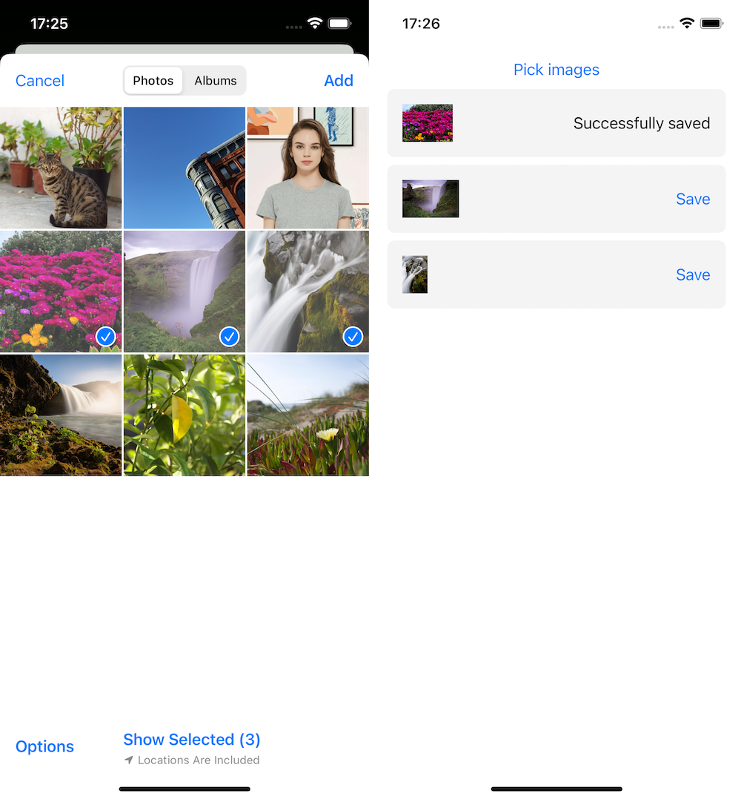

# {{ $frontmatter.title }}

{{ $frontmatter.description }}

## Prerequisites

1. Familiar with `Swift Concurrency`. If still don't know what this is, you can check this awesome playlist first. [Swift Concurrency (Intermediate Level) by Swiftful Thinking](https://www.youtube.com/playlist?list=PLwvDm4Vfkdphr2Dl4sY4rS9PLzPdyi8PM) 

## Source code

1. Clone Github repo https://github.com/arnosolo/learn-ios-development
2. Open `codes/demo1-image-picker` with Xcode
3. Image Picker `Components/ImagePicker.swift`
4. Image Saver `Utils/ImageSaver.swift`