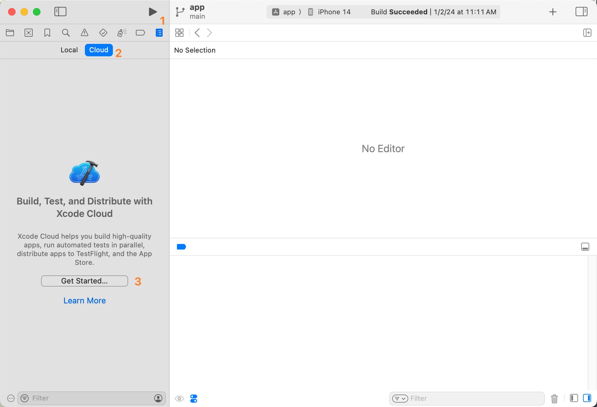

# {{ $frontmatter.title }}

{{ $frontmatter.description }}

## Prerequisites

1. An Apple ID that has joined Apple Developer Program
2. A Github account

## Create a Xcode project

1. Create a `Bundle ID` at [Apple Developer website](https://developer.apple.com/)
2. Create an `App` [App Store Connect](https://appstoreconnect.apple.com/)
   > Note: The term "App" here means a project we create at App Store Connect rather an App on your phone.
3. Use the newly created `Bundle ID` to create a `Xcode` project.
4. Make sure signing of the `Xcode` project is valid.
5. Run the App, make sure it works.
6. Git init, then push this repo to `Github`.

## Manually build

### Basic workflow

1. Set `Run Destination` as `Any iOS Device`
2. Click `Product` > `Archive` to start building
3. After building completed, a small window with a title `Archives` will be opened. Click `Distribute App`, then waiting upload complete.
4. After upload complete, you should be able to find this build at [App Store Connect](https://appstoreconnect.apple.com/) > `TestFlight`


### Increase version

If you want upload your build to `TestFlight` again, then you must update version at `app.xcodeproj` > `General` > `Identity` first.


## Automatically build

After setting up `Xcode Cloud` workflow, your App will automatically build and publish to `TestFlight` by `Xcode Cloud` after you push a commit to `Github`.
> Note: Until now (2024-01-07) you can only create your first Xcode Cloud Workflow with Xcode rather than [App Store Connect](https://appstoreconnect.apple.com/) > `Xcode Cloud`

### Basic workflow

You can find the setup workflow button as following picture showed. You can also find more detailed guide at [Configuring your first Xcode Cloud workflow | Apple](https://developer.apple.com/documentation/xcode/configuring-your-first-xcode-cloud-workflow)


### Increase version

We will use a js script to automatically increase version. Since `Xcode Cloud` will run `ci_scripts/ci_post_clone.sh` script before building, we should place our custom script there.
> You can find more about Xcode Cloud custom build scripts here -> [Writing custom build scripts | Apple](https://developer.apple.com/documentation/xcode/writing-custom-build-scripts)

::: code-group
<<< ../codes/demo3-build-ios-app-with-xcode-cloud/ci_scripts/ci_post_clone.sh
<<< ../codes/demo3-build-ios-app-with-xcode-cloud/ci_scripts/changeAppInfo.mjs{js}
:::

### App Icon

You App Icon can not have alpha channel, otherwise `Xcode Cloud` will failed to build.

### (Optional) Other notes

1. Use `build_ios` branch to trigger build instead of `main` branch.
   ```bash
   git checkout build_ios && git rebase main && git push && git checkout main
   ```
