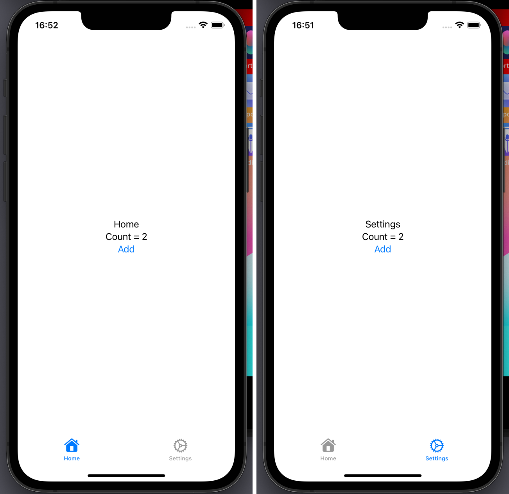

# {{ $frontmatter.title }}

{{ $frontmatter.description }}



## Step by step guide

### Define your model

```swift
//  SettingStore.swift
import Foundation

class SettingStore: ObservableObject {
    @Published var count: Int = 0
}
```

### Create an instance of your model at the root of your view hierarchy

```swift
//  AppEntry.swift
import SwiftUI

@main
struct AppEntry: App {
    @StateObject var settingStore = SettingStore()

    var body: some Scene {
        WindowGroup {
            ContentView()
                .environmentObject(settingStore)
        }
    }
}
```

### Access the environment object in your views

```swift
// HomeView.swift
import SwiftUI

struct HomeView: View {
    @EnvironmentObject var settingStore: SettingStore

    var body: some View {
        VStack {
            Text("Home")
            Text("Count = \(settingStore.count)")
            Button("Add") {
                settingStore.count += 1
            }
        }
    }
}
```

Another view
```swift
// SettingsView.swift
import SwiftUI

struct SettingsView: View {
    @EnvironmentObject var settingStore: SettingStore

    var body: some View {
        VStack {
            Text("Settings")
            Text("Count = \(settingStore.count)")
            Button("Add") {
                settingStore.count += 1
            }
        }
    }
}
```

## Source code

https://github.com/arnosolo/learn-ios-development/tree/main/codes/demo4-global-state-swiftui
