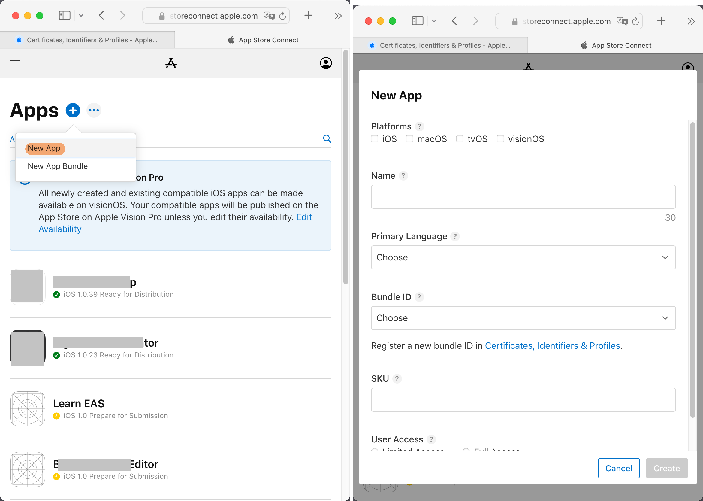

# {{ $frontmatter.title }}

## 效果演示

1. 提交一个`commit`到`Github仓库`的`main`分支.
   ```bash
   git push
   ```
2. 观察到`Xcode Cloud`自动开始构建应用, 并将构建结果发布到`TestFlight`上.

## 前提条件

1. 你的`Apple ID`已加入[苹果开发者计划](https://developer.apple.com/cn/programs/)
2. 一个`Github`账户

## 创建一个 Xcode 项目

### 创建一个新的`Bundle ID`

每一个苹果应用都有一个ID, 苹果称之为`Bundle ID`. 这个ID可以在苹果开发者网站中申请, 具体的网址为 [Apple Developer > Account > Certificates, IDs & Profiles > Identifiers](https://developer.apple.com/account/resources/identifiers/list).


### 创建一个`App Store Connect App`

想要在`App Store`发布应用, 就必须用到 [App Store Connect](https://appstoreconnect.apple.com/) 网站. 之后像是什么更新应用, 添加`TestFlight`测试者, 查看`Xcode Cloud`日志, 全部都是在这个网站上操作的.

1. 在 Apps 页面点击 New App.
2. 填写 New App 表格. 你可能会问 SKU 怎么写, 其实可以随便写, 我一般直接填入`Bundle ID`.
   


### 创建`Xcode`项目

1. 打开`Xcode`, 创建一个新的项目. 
2. 然后将此项目的`Bundle ID`修改为我们新创建的`Bundle ID`. 修改位置在 `左侧导航栏` > `app.xcodeproj` > `Signing & Capabilities` > `Signing` > `Bundle Identifier`.
   
3. 修改`Bundle ID`后, `Xcode`会自动获取`Profile`. 点击 `Provisioning Profile` 右边的i图标, 如果全部是打勾, 则说明获取成功.
     
4. 在 iOS 模拟器上运行该项目, 保证该项目可以正常运行.

## 手动构建并上传

### 首次上传

1. 设置 `Run Destination` 为 `Any iOS Device`
2. 点击 `顶部菜单栏` > `Product` > `Archive` 以开始构建
3. 在构建完成后一个名为 `Archives` 的窗口会自动弹出(该窗口亦可通过 `顶部菜单栏` > `Window` > `Organizer` 打开). 选择刚刚生成的 `Archive`, 然后点击 `Distribute App`. 如此, 应用便开始上传到`TestFlight`.
   
4. 当`Archive`上传完成后, 你就能在 [App Store Connect > TestFlight](https://appstoreconnect.apple.com/) 网页中找到你刚刚上传的项目了.
5. 在`TestFlight`中设置该版本的加密方式, 我一般选未加密. 如果不想每次都手动设置加密方式的话, 我们可以在`Info.plist`中设置应用加密方法.
   ```xml
   <dict>
    ...
    <key>ITSAppUsesNonExemptEncryption</key>
    <false/>
   </dict>
   ```
6. 在`TestFlight`中创建一个`内部测试组`(INTERNAL TESTING). 把你的`iPhone`上使用的`Apple ID`加到组里, 然后你就能在你的注册`Apple ID`所使用的邮箱中找到一封来自`TestFlight`的邀请. 点击`View in TestFlight`这将打开`TestFlight`, `TestFlight`会询问你是否接受邀请, 点击`Accept`. 如此以后你就能在你的`iPhone`的`TestFlight`应用中找到测试应用, 测试应用更新时你的`iPhone`会收到通知.
     

### 加大版本号

如果你想上传一个~~船新版本~~新的版本到`TestFlight`, 那么你必须先到 `左侧导航栏` > `app.xcodeproj` > `General` > `Identity` 加大应用的版本号. 因为 `TestFlight` 只接受比当前版本大的 `Archive`.


## Xcode Cloud 自动构建并上传

在设置完 `Xcode Cloud workflow` 后, 每次 `Github仓库` 的 `main` 分支变化时, `Xcode Cloud` 就会自动开始构建 `Archive`, 完成后自动将其上传到 `TestFlight`.

### 创建 Github 仓库

创建一个`main`分支, 然后将这个分支上传`Github仓库`.

### 创建 Xcode Cloud workflow

1. 创建 `workflow` 的按钮在 `Xcode` > `左侧导航栏` > `最右边那个标签` > `Cloud` > `Get Started`
   
2. 创建过程中需要为 `workflow` 增加一个 `Build` 类型的 `Action`.
   
3. 此时如果我们向 `Github仓库` 的 `main` 分支提交一个 `commit`, 应该就会触发 `Xcode Cloud` 的自动构建了. 你可以在 [App Store Connect > Xcode Cloud](https://appstoreconnect.apple.com/) 观察构建过程.

### 构建完成后自动发布到 TestFlight

上述 `workflow` 配置了自动构建, 但是没有配置自动发布. 我们现在跳转到 [App Store Connect > Xcode Cloud](https://appstoreconnect.apple.com/).

打开要编辑的 `workflow`, 然后增加一个 `Post-Action`, 类型为 `TestFlight Internal Testing`. 选择你之前创建的测试组, 然后每次 `Xcode Cloud` 构建完成后就会自动发布到 `TestFlight` 了.
  

### 自动加大版本号

根据苹果的文档 [Writing custom build scripts | Apple](https://developer.apple.com/documentation/xcode/writing-custom-build-scripts), `Xcode Cloud` 在构建 `Archive` 之前, 会运行项目文件夹下的 `ci_scripts/ci_post_clone.sh` 文件. 所以我们可以在该文件中运行一个`js`脚本来加大版本号.

::: code-group
<<< ../../codes/demo3-build-ios-app-with-xcode-cloud/ci_scripts/ci_post_clone.sh
<<< ../../codes/demo3-build-ios-app-with-xcode-cloud/ci_scripts/changeAppInfo.mjs{js}
:::

### 应用图标

使用`Xcode Cloud`构建时, 应用图标不得有`alpha通道`, 其实就是不能有透明的像素. 你可以通过将应用图标转换为`jpeg`格式来解决这个问题, 因为`jpeg`格式的图片没有`alpha通道`.

## 参考材料

- [Configuring your first Xcode Cloud workflow | Apple](https://developer.apple.com/documentation/xcode/configuring-your-first-xcode-cloud-workflow)
